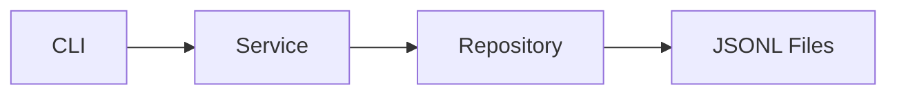
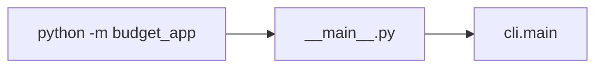
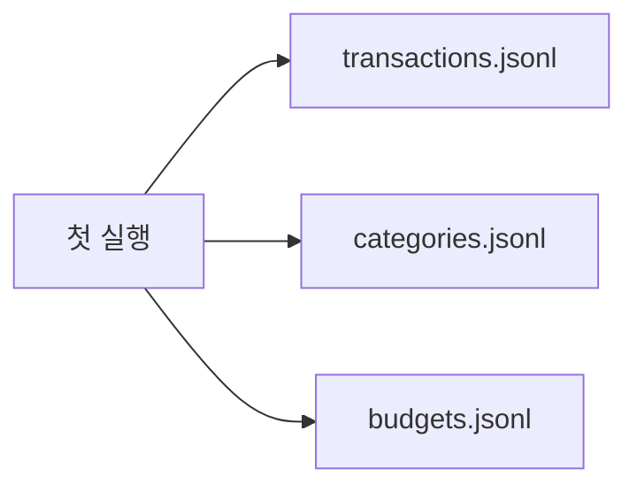
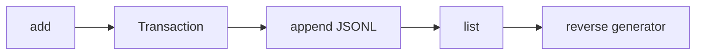
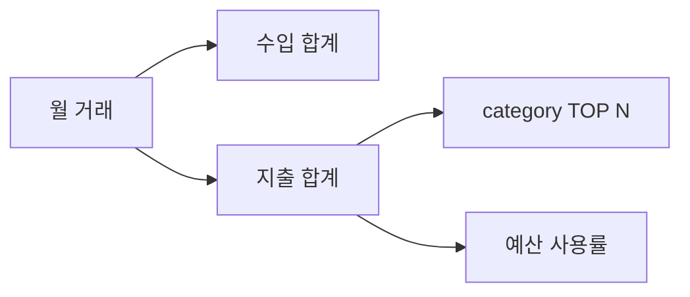
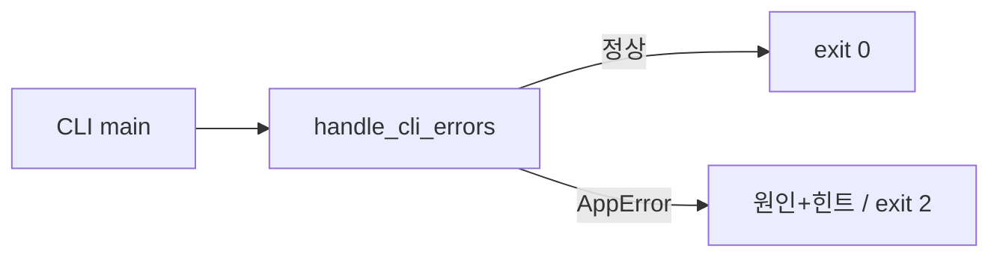

# B2-1 Round 01 — Beginner Guide

이 문서는 공식 `b2-1-mission.pdf`, `b2-1-mission.md`, `b2-1-evaluation.md`를 기준으로 파일 기반 가계부 CLI를 처음부터 이해하고 검증하기 위한 가이드입니다.

> 현재는 **Phase A — REFERENCE BUILD**입니다. Reference 코드는 먼저 준비하되, 실제 터미널 실행·재실행·오류 경로·Evidence는 Phase C에서 확인합니다. 실제 실행하지 않은 항목은 PASS/CLEAR로 기록하지 않습니다.

## 00. 미션 한눈에 보기

- Python 3.10+
- 표준 라이브러리만 사용
- `python -m budget_app <command>`
- 거래/카테고리/예산을 3개 이상 파일로 영구 저장
- add/list/search/summary/budget/category/update/delete/import/export
- list/search는 generator streaming
- decorator 1개 이상 실제 적용
- type hints
- 3개 이상 모듈, 2개 이상 클래스
- 오류는 stacktrace 대신 원인+힌트, 오류 exit code는 0이 아님

Reference는 내부 저장에 **JSONL**, 외부 교환에 공식 CSV 스키마를 사용합니다.



CLI는 사용자 입력/출력, Service는 업무 규칙, Repository는 파일 I/O를 담당합니다.

---

# STEP 01 — Python 환경과 Reference 구조 확인

## ① 왜 하는가

공식 미션은 Python 3.10 이상과 표준 라이브러리만 허용합니다. 먼저 실행 환경과 코드 구조를 확인해야 이후 오류를 패키지 문제와 프로그램 문제로 구분할 수 있습니다.

## ② 무엇을 하는가

Python 버전, Reference package, 주요 모듈, CLI help를 확인합니다.

## ③ 이번 단계에서 알아야 할 용어

- **모듈 (Module)** — Python 파일 하나를 기능 단위로 나눈 것입니다.
- **패키지 (Package)** — 여러 Python 모듈을 묶은 디렉터리입니다.
- **엔트리 포인트 (Entry Point)** — 프로그램 실행이 시작되는 위치입니다. 여기서는 `budget_app.__main__`입니다.

## ④ 필요한 핵심 개념



`python -m`을 사용하면 패키지 구조를 유지한 채 CLI를 실행할 수 있습니다.

## ⑤ 실행할 명령어 또는 코드

Repository 루트에서:

```bash
python3 --version
export PYTHONPATH="$PWD/training/round-01-clear/reference"
python3 -m budget_app --help
find training/round-01-clear/reference/budget_app -maxdepth 1 -type f -print
```

## ⑥ 명령어와 코드에 입문자가 이해할 수 있는 주석

- `PYTHONPATH`: Python이 `budget_app` 패키지를 찾을 위치를 알려 줍니다.
- `--help`: 실제 데이터를 바꾸지 않고 CLI 사용법만 확인합니다.
- `find`: Reference 모듈 구성을 확인합니다.

## ⑦ 예상되는 정상 결과

Python 3.10 이상이 표시되고 add/list/search/summary/update/delete/budget/category/import/export가 help에 나타납니다.

## ⑧ 그 결과가 의미하는 것

외부 pip 패키지 없이 B2-1 CLI를 실행할 기본조건이 준비된 것입니다.

## ⑨ 자주 발생하는 오류와 해결 방법

- `No module named budget_app` → Repository 루트인지, `PYTHONPATH` 경로가 맞는지 확인합니다.
- Python 3.9 이하 → Python 3.10+ 환경으로 변경합니다.

## ⑩ 완료 확인

- [ ] Python 3.10+
- [ ] `python -m budget_app --help`
- [ ] 3개 이상 모듈 구조 확인

---

# STEP 02 — JSONL 3개 파일과 초기 카테고리 이해

## ① 왜 하는가

공식 요구사항은 거래·카테고리·예산을 3개 이상 파일에 영구 저장하고, 초기 실행 시 파일이 없을 때 명확히 처리하는 것입니다.

## ② 무엇을 하는가

별도 실습 데이터 디렉터리에서 첫 실행을 하고 세 파일과 기본 카테고리가 자동 생성되는지 확인합니다.

## ③ 이번 단계에서 알아야 할 용어

- **JSONL (JSON Lines)** — 한 줄에 JSON 객체 하나를 저장하는 형식입니다.
- **영구 저장 (Persistence)** — 프로그램이 종료되어도 데이터가 파일에 남는 것입니다.
- **데이터 디렉터리 (Data Directory)** — 실제 저장 파일을 모아 두는 폴더입니다.

## ④ 필요한 핵심 개념



Reference는 카테고리 파일이 비어 있으면 `food`, `transport`, `rent`, `salary`, `etc`를 자동 생성합니다.

## ⑤ 실행할 명령어 또는 코드

```bash
export B2_DATA=/tmp/codyssey-b2-1-data
rm -rf "$B2_DATA"
python3 -m budget_app --data-dir "$B2_DATA" category list
ls -l "$B2_DATA"
```

## ⑥ 명령어와 코드에 입문자가 이해할 수 있는 주석

- `--data-dir`: 개인 기존 파일과 분리된 실습 저장 위치를 지정합니다.
- `category list`: 초기 카테고리를 읽는 동시에 저장소 초기화가 되었는지 확인합니다.

## ⑦ 예상되는 정상 결과

기본 카테고리 목록이 출력되고 `transactions.jsonl`, `categories.jsonl`, `budgets.jsonl` 세 파일이 존재합니다.

## ⑧ 그 결과가 의미하는 것

프로그램 종료와 관계없이 유지되는 파일 기반 저장 구조가 만들어졌습니다.

## ⑨ 자주 발생하는 오류와 해결 방법

- Permission denied → 쓰기 가능한 실습 폴더를 사용합니다.
- 기존 데이터가 섞임 → 다른 `--data-dir`을 사용합니다.

## ⑩ 완료 확인

- [ ] 저장 파일 3개
- [ ] 기본 카테고리
- [ ] 개인 데이터와 분리

---

# STEP 03 — add와 list: 거래 저장과 최신순 스트리밍

## ① 왜 하는가

거래를 저장하고 다시 읽는 것이 가계부의 가장 기본 흐름이며, 공식 요구사항은 list를 전체 메모리 로드가 아닌 generator streaming으로 구현하도록 요구합니다.

## ② 무엇을 하는가

대화형 add로 거래를 몇 건 저장하고 `list --limit`으로 최신순 출력합니다.

## ③ 이번 단계에서 알아야 할 용어

- **데이터 클래스 (dataclass)** — 데이터 필드와 기본 동작을 간결하게 정의하는 Python 구조입니다.
- **제너레이터 (Generator)** — 데이터를 한꺼번에 모두 만들지 않고 필요할 때 하나씩 `yield`하는 방식입니다.
- **스트리밍 (Streaming)** — 전체 파일을 메모리에 올리지 않고 순차적으로 처리하는 방식입니다.

## ④ 필요한 핵심 개념



Reference의 `iter_jsonl_reverse()`는 파일 뒤쪽을 블록 단위로 읽어 최신 거래부터 하나씩 반환합니다.

## ⑤ 실행할 명령어 또는 코드

```bash
python3 -m budget_app --data-dir "$B2_DATA" add
python3 -m budget_app --data-dir "$B2_DATA" add
python3 -m budget_app --data-dir "$B2_DATA" list --limit 1
python3 -m budget_app --data-dir "$B2_DATA" list --limit 10
```

add 입력 예:

```text
날짜(YYYY-MM-DD): 2026-08-16
타입(income/expense): expense
카테고리: food
금액(양수): 15000
메모(선택): 점심
태그(쉼표로 구분, 없으면 엔터): meal
```

## ⑥ 명령어와 코드에 입문자가 이해할 수 있는 주석

- 생성 ID는 `TX-000001`처럼 증가합니다.
- `list --limit 1`은 최신 1건만 필요하므로 generator가 필요한 만큼 읽고 멈춥니다.

## ⑦ 예상되는 정상 결과

add마다 `[저장 완료] id=...`가 출력되고 list는 가장 최근 거래부터 표시합니다.

## ⑧ 그 결과가 의미하는 것

입력 → 모델 검증 → 파일 저장 → streaming 조회의 기본 서비스 흐름이 연결되었습니다.

## ⑨ 자주 발생하는 오류와 해결 방법

- 잘못된 날짜/금액/type → 원인과 힌트를 확인해 올바른 값으로 다시 실행합니다.
- 없는 category → `category list` 또는 `category add`를 먼저 사용합니다.

## ⑩ 완료 확인

- [ ] add 성공 + ID
- [ ] list 최신순
- [ ] `--limit`
- [ ] 재실행 후 거래 유지

---

# STEP 04 — search: 조건을 걸어도 streaming 유지

## ① 왜 하는가

공식 요구사항은 기간·카테고리·타입·메모 키워드·태그 검색을 지원하고, 검색도 generator 기반으로 유지하도록 요구합니다.

## ② 무엇을 하는가

각 검색 조건을 실제 저장 데이터에 적용합니다.

## ③ 이번 단계에서 알아야 할 용어

- **필터 (Filter)** — 조건에 맞는 데이터만 통과시키는 처리입니다.
- **키워드 검색 (Keyword Search)** — 문자열에 특정 단어가 포함되는지 확인하는 검색입니다.

## ④ 필요한 핵심 개념


검색 결과도 별도 전체 list를 만들지 않고 조건에 맞는 거래를 하나씩 반환합니다.

## ⑤ 실행할 명령어 또는 코드

```bash
python3 -m budget_app --data-dir "$B2_DATA" search --from 2026-08-01 --to 2026-08-31
python3 -m budget_app --data-dir "$B2_DATA" search --category food
python3 -m budget_app --data-dir "$B2_DATA" search --type expense
python3 -m budget_app --data-dir "$B2_DATA" search --q 점심
python3 -m budget_app --data-dir "$B2_DATA" search --tag meal
```

## ⑥ 명령어와 코드에 입문자가 이해할 수 있는 주석

`--from`/`--to`는 날짜 범위, `--q`는 memo 문자열, `--tag`는 tags 목록을 검사합니다.

## ⑦ 예상되는 정상 결과

조건을 만족하는 거래만 최신순으로 출력되며 결과가 없으면 명확한 안내가 표시됩니다.

## ⑧ 그 결과가 의미하는 것

저장 구조를 그대로 유지하면서 여러 조건을 조합해 필요한 데이터를 찾을 수 있습니다.

## ⑨ 자주 발생하는 오류와 해결 방법

- `--from`이 `--to`보다 늦음 → 날짜 범위를 바로잡습니다.
- 등록되지 않은 category 검색 → `category list`로 실제 이름을 확인합니다.

## ⑩ 완료 확인

- [ ] 기간
- [ ] category
- [ ] type
- [ ] q
- [ ] tag
- [ ] 최신순

---

# STEP 05 — update/delete와 원자적 파일 교체

## ① 왜 하는가

파일 기반 저장은 수정/삭제 중 중단되면 데이터가 손상될 수 있습니다. 공식 미션은 안정적인 전체 재작성/임시 파일/원자적 교체를 고려하도록 요구합니다.

## ② 무엇을 하는가

옵션 기반 update와 ID 기반 delete를 실행하고 존재하지 않는 ID 오류도 확인합니다.

## ③ 이번 단계에서 알아야 할 용어

- **원자적 교체 (Atomic Replace)** — 최종 교체가 한 시점에 일어나도록 파일을 바꾸는 방식입니다.
- **임시 파일 (Temporary File)** — 기존 파일 대신 새 내용을 먼저 완성하는 보조 파일입니다.

## ④ 필요한 핵심 개념


기존 파일을 먼저 비우지 않고 새 파일을 완성한 뒤 교체합니다.

## ⑤ 실행할 명령어 또는 코드

먼저 list에서 실제 ID를 확인한 뒤:

```bash
python3 -m budget_app --data-dir "$B2_DATA" update --id TX-000001 --amount 18000 --memo "저녁"
python3 -m budget_app --data-dir "$B2_DATA" list --limit 10
python3 -m budget_app --data-dir "$B2_DATA" delete --id TX-000001
python3 -m budget_app --data-dir "$B2_DATA" delete --id TX-999999; echo "exit=$?"
```

## ⑥ 명령어와 코드에 입문자가 이해할 수 있는 주석

Reference의 update는 옵션 방식으로 고정되어 있으며 지정하지 않은 필드는 기존 값을 유지합니다. 없는 ID는 정상 성공으로 숨기지 않고 오류로 처리합니다.

## ⑦ 예상되는 정상 결과

정상 ID는 수정/삭제되고, 없는 ID는 `[오류]`와 `[힌트]`, `exit=2`가 확인됩니다.

## ⑧ 그 결과가 의미하는 것

CRUD의 Update/Delete와 오류 계약, 파일 재작성 안정성을 함께 확인한 것입니다.

## ⑨ 자주 발생하는 오류와 해결 방법

- 수정 옵션을 하나도 주지 않음 → 최소 한 필드를 지정합니다.
- category를 없는 값으로 변경 → 먼저 category add를 실행합니다.

## ⑩ 완료 확인

- [ ] 옵션 기반 update
- [ ] delete
- [ ] 없는 ID 오류
- [ ] nonzero exit
- [ ] 원자적 교체 구조 설명 가능

---

# STEP 06 — summary와 budget

## ① 왜 하는가

단순 CRUD를 넘어 한 달의 수입/지출을 집계하고 예산과 비교해야 실제 가계부 기능이 됩니다.

## ② 무엇을 하는가

월 예산을 저장하고 월별 총수입/총지출/잔액/카테고리 TOP N/예산 사용률/초과 여부를 출력합니다.

## ③ 이번 단계에서 알아야 할 용어

- **집계 (Aggregation)** — 여러 거래를 합계나 순위로 요약하는 계산입니다.
- **예산 사용률 (Budget Usage)** — 월 지출 ÷ 월 예산 × 100입니다.

## ④ 필요한 핵심 개념



## ⑤ 실행할 명령어 또는 코드

```bash
python3 -m budget_app --data-dir "$B2_DATA" budget set --month 2026-08 --amount 500000
python3 -m budget_app --data-dir "$B2_DATA" summary --month 2026-08 --top 3
python3 -m budget_app --data-dir "$B2_DATA" summary --month 2099-01 --top 3
```

## ⑥ 명령어와 코드에 입문자가 이해할 수 있는 주석

예산은 `budgets.jsonl`에 영구 저장되고 summary가 같은 월의 예산을 읽어 사용률을 계산합니다.

## ⑦ 예상되는 정상 결과

데이터가 있는 달은 수입/지출/잔액/TOP N과 예산 정보가 나오고, 없는 달은 `데이터 없음`이 명확히 표시됩니다.

## ⑧ 그 결과가 의미하는 것

거래 파일과 예산 파일의 데이터를 서비스 계층에서 함께 사용해 월 단위 비즈니스 결과를 만든 것입니다.

## ⑨ 자주 발생하는 오류와 해결 방법

- `YYYY-MM` 오류 → 월 형식을 수정합니다.
- 예산 0/음수 → 양의 정수로 입력합니다.

## ⑩ 완료 확인

- [ ] budget persistence
- [ ] total income/expense/balance
- [ ] TOP N
- [ ] usage %
- [ ] over-budget warning
- [ ] no-data month

---

# STEP 07 — category 관리와 참조 무결성

## ① 왜 하는가

거래가 사용하는 category를 무작정 삭제하면 데이터 의미가 깨질 수 있습니다.

## ② 무엇을 하는가

카테고리를 추가/조회/삭제하고 사용 중인 카테고리는 삭제가 차단되는지 확인합니다.

## ③ 이번 단계에서 알아야 할 용어

- **참조 무결성 (Referential Integrity)** — 어떤 데이터가 참조하는 대상이 유효하게 유지되도록 하는 원칙입니다.

## ④ 필요한 핵심 개념


파일 기반 프로그램에서도 관계형 DB와 비슷하게 참조 대상의 유효성을 지켜야 합니다.

## ⑤ 실행할 명령어 또는 코드

```bash
python3 -m budget_app --data-dir "$B2_DATA" category add --name health
python3 -m budget_app --data-dir "$B2_DATA" category list
python3 -m budget_app --data-dir "$B2_DATA" category remove --name health
```

사용 중인 `food` 등을 삭제해 오류도 확인합니다.

```bash
python3 -m budget_app --data-dir "$B2_DATA" category remove --name food; echo "exit=$?"
```

## ⑥ 명령어와 코드에 입문자가 이해할 수 있는 주석

Reference는 사용 중인 category 삭제를 막는 정책을 선택했습니다. 필요하면 먼저 해당 거래를 update합니다.

## ⑦ 예상되는 정상 결과

사용하지 않는 category는 삭제되고, 사용 중인 category는 오류와 해결 힌트를 출력합니다.

## ⑧ 그 결과가 의미하는 것

파일 저장에서도 데이터 사이의 규칙을 서비스 계층이 보호하고 있습니다.

## ⑨ 자주 발생하는 오류와 해결 방법

이미 존재하는 카테고리는 중복 추가하지 않고 안내합니다.

## ⑩ 완료 확인

- [ ] add
- [ ] list
- [ ] remove
- [ ] in-use 보호

---

# STEP 08 — CSV import/export

## ① 왜 하는가

공식 미션은 외부 파일에서 거래를 가져오고 조건에 맞는 거래를 CSV로 내보내는 기능을 요구합니다.

## ② 무엇을 하는가

공식 최소 CSV 스키마로 export하고 다시 import하며 일부 잘못된 행 처리도 확인합니다.

## ③ 이번 단계에서 알아야 할 용어

- **CSV (Comma-Separated Values)** — 표 형태 데이터를 텍스트로 교환하는 형식입니다.
- **스키마 (Schema)** — 파일이 가져야 할 컬럼과 데이터 규칙입니다.
- **부분 성공 (Partial Success)** — 정상 행은 처리하고 잘못된 행은 별도 보고하는 정책입니다.

## ④ 필요한 핵심 개념

공식 CSV 컬럼은 `date,type,category,amount,memo,tags`이며 UTF-8/헤더 포함입니다.

## ⑤ 실행할 명령어 또는 코드

```bash
python3 -m budget_app --data-dir "$B2_DATA" export --out /tmp/b2-1-export.csv --month 2026-08
head -n 5 /tmp/b2-1-export.csv

export B2_IMPORT=/tmp/codyssey-b2-1-imported
rm -rf "$B2_IMPORT"
python3 -m budget_app --data-dir "$B2_IMPORT" import --from /tmp/b2-1-export.csv
python3 -m budget_app --data-dir "$B2_IMPORT" list --limit 20
```

조건 없이 export하는 오류도 확인합니다.

```bash
python3 -m budget_app --data-dir "$B2_DATA" export --out /tmp/no-condition.csv; echo "exit=$?"
```

## ⑥ 명령어와 코드에 입문자가 이해할 수 있는 주석

Export는 `--month` 또는 `--from`+`--to` 조건이 필요합니다. Import는 깨진 행을 `skipped`로 보고해 전체 성공으로 오해하지 않게 합니다.

## ⑦ 예상되는 정상 결과

CSV 헤더/컬럼이 공식 스키마와 같고 import 후 거래가 생성됩니다. 잘못된 행은 행 번호와 원인이 표시됩니다.

## ⑧ 그 결과가 의미하는 것

내부 JSONL 저장과 외부 CSV 교환을 분리하면서 정해진 계약으로 데이터를 주고받을 수 있습니다.

## ⑨ 자주 발생하는 오류와 해결 방법

- CSV 필수 컬럼 누락 → 헤더를 공식 스키마에 맞춥니다.
- 등록되지 않은 category → category를 먼저 등록하거나 CSV를 수정합니다.

## ⑩ 완료 확인

- [ ] export 조건
- [ ] UTF-8 header
- [ ] 6개 CSV 컬럼
- [ ] import
- [ ] broken row report

---

# STEP 09 — decorator, type hints, 오류 종료 코드 이해

## ① 왜 하는가

평가는 기능만 아니라 공통 관심사 분리, 타입 계약, 사용자 친화적 오류 처리를 설명할 수 있는지 확인합니다.

## ② 무엇을 하는가

`handle_cli_errors`, 함수 type hints, 대표 오류 출력을 코드와 실제 실행으로 연결합니다.

## ③ 이번 단계에서 알아야 할 용어

- **데코레이터 (Decorator)** — 함수 실행 전후의 공통 동작을 별도로 감싸는 Python 기능입니다.
- **타입 힌트 (Type Hint)** — 함수 입력/출력의 예상 타입을 코드에 명시하는 표기입니다.
- **종료 코드 (Exit Code)** — shell에 성공/실패를 숫자로 전달하는 값입니다.

## ④ 필요한 핵심 개념



## ⑤ 실행할 명령어 또는 코드

```bash
python3 -m budget_app --data-dir "$B2_DATA" delete --id TX-999999
echo "exit=$?"

grep -Rni 'def handle_cli_errors\|Generator\[Transaction' \
  training/round-01-clear/reference/budget_app
```

## ⑥ 명령어와 코드에 입문자가 이해할 수 있는 주석

`handle_cli_errors`는 각 기능마다 반복될 예외 출력 코드를 한 곳에 모읍니다. `Generator[Transaction, ...]`은 streaming 반환 계약을 코드에서 보여 줍니다.

## ⑦ 예상되는 정상 결과

오류에 stacktrace가 없고 `[오류]`, `[힌트]`, `exit=2`가 보입니다.

## ⑧ 그 결과가 의미하는 것

사람과 shell 모두 실패를 명확히 인식할 수 있고, 코드의 공통 오류 정책도 한 곳에서 관리됩니다.

## ⑨ 자주 발생하는 오류와 해결 방법

argparse가 잘못된 옵션을 받으면 자체 사용법과 함께 exit 2를 반환합니다. 이는 정상적인 CLI 오류 처리입니다.

## ⑩ 완료 확인

- [ ] decorator 실제 적용
- [ ] type hints 사례 설명
- [ ] stacktrace 없음
- [ ] 오류 exit != 0

---

# STEP 10 — 테스트, Persistence, Evidence, CLEAR

## ① 왜 하는가

Reference 코드가 존재하는 것과 실제 미션이 완료된 것은 다릅니다. 자동 테스트와 실제 CLI 재실행을 모두 확인해야 합니다.

## ② 무엇을 하는가

`verify.sh`, unit tests, 실제 프로그램 재실행, Evidence, Evaluation Q&A를 최종 확인합니다.

## ③ 이번 단계에서 알아야 할 용어

- **단위 테스트 (Unit Test)** — 작은 기능 단위를 자동 검증하는 테스트입니다.
- **검증 (Verification)** — 요구사항대로 구현됐는지 확인하는 과정입니다.
- **Evidence** — 실제로 요구사항을 충족했다는 증거입니다.

## ④ 필요한 핵심 개념

```text
Requirement → Implementation → Test/Runtime → Evidence → CLEAR
```

## ⑤ 실행할 명령어 또는 코드

```bash
bash training/round-01-clear/environment/verify.sh
```

재실행 persistence 확인:

```bash
python3 -m budget_app --data-dir "$B2_DATA" list --limit 10
python3 -m budget_app --data-dir "$B2_DATA" summary --month 2026-08 --top 3
```

## ⑥ 명령어와 코드에 입문자가 이해할 수 있는 주석

`verify.sh`는 Python 버전, Reference 파일, compile, unit tests, command help를 확인하지만 실제 학습 데이터의 모든 사용자 흐름을 대신하지는 않습니다.

## ⑦ 예상되는 정상 결과

자동 검증은 `Result: N PASS / 0 FAIL`, 실제 재실행에서도 저장 데이터가 유지됩니다.

## ⑧ 그 결과가 의미하는 것

기능·구조·오류·파일 persistence의 필수 요구를 자동/수동으로 교차 확인한 것입니다.

## ⑨ 자주 발생하는 오류와 해결 방법

FAIL 한 항목만 해당 Step으로 돌아가 수정합니다. 데이터 전체 삭제나 대규모 재설계부터 하지 않습니다.

## ⑩ 완료 확인

- [ ] verify 0 FAIL
- [ ] 정상 명령 실제 확인
- [ ] 대표 오류 실제 확인
- [ ] 재실행 persistence
- [ ] Evidence 정리
- [ ] Evaluation Q&A 자기 말 설명
- [ ] **✅ B2-1 CLEAR**

---

## Reference 파일

- `REFERENCE-BUILD.md`
- `reference/budget_app/`
- `reference/tests/`
- `reference/README.md`
- `environment/README.md`
- `environment/verify.sh`
- `environment/reset.sh`
- `docs/requirements-mapping.md`
- `docs/evaluation-qa.md`
- `evidence/README.md`
