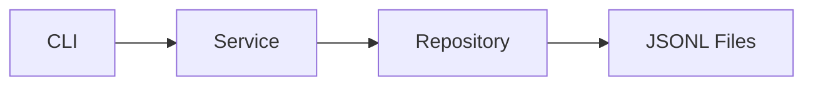

# B2-1 Round 01 — Beginner Guide

이 문서는 공식 `b2-1-mission.pdf`, `b2-1-mission.md`, `b2-1-evaluation.md`를 기준으로 파일 기반 가계부 CLI를 처음부터 이해하고 검증하기 위한 **전체 중앙 허브(Global Hub)**입니다.

> 현재 상태: **Phase A Reference Build = CORE READY / Runtime Mission = NOT STARTED**  
> 실제 터미널 실행·재실행·오류 경로·Evidence를 확인하기 전에는 PASS/CLEAR로 기록하지 않습니다.

## 🚀 빠른 시작(Quick Start)

### 처음 시작하는 경우

Repository 루트에서 아래 순서로 진행합니다.

```bash
python3 --version
export PYTHONPATH="$PWD/training/round-01-clear/reference"
python3 -m budget_app --help
```

정상 기준:

- Python 3.10 이상
- `add/list/search/summary/update/delete/budget/category/import/export`가 help에 표시
- 오류가 있으면 다음 단계로 넘어가지 않고 해당 원인을 먼저 해결

그 다음 [Module 01 — Foundations](guide/01-foundations/README.md)부터 순서대로 진행합니다.

### 이미 한 번 수행했고 다시 검증하는 경우

```bash
export PYTHONPATH="$PWD/training/round-01-clear/reference"
bash training/round-01-clear/environment/verify.sh
```

`0 FAIL`이어도 실제 CLI·영구 저장·오류 경로·Evidence 확인 전에는 Mission CLEAR가 아닙니다.

---

## 📑 목차

- [미션 한눈에 보기](#mission-overview)
- [학습 지도](#learning-map)
- [Module 01 — Foundations](guide/01-foundations/README.md)
- [Module 02 — Transactions](guide/02-transactions/README.md)
- [Module 03 — Analysis & Rules](guide/03-analysis-rules/README.md)
- [Module 04 — Data Exchange](guide/04-data-exchange/README.md)
- [Module 05 — Verification & CLEAR](guide/05-verification/README.md)
- [실행·검증·증빙 문서](#runtime-docs)
- [완료 조건](#completion)

<a id="mission-overview"></a>
## 00. 미션 한눈에 보기

- Python 3.10+
- 표준 라이브러리만 사용
- `python -m budget_app <command>`
- 거래/카테고리/예산을 3개 이상 파일로 영구 저장
- add/list/search/summary/budget/category/update/delete/import/export
- list/search는 generator streaming
- decorator 1개 이상 실제 적용
- type hints
- 3개 이상 모듈, 2개 이상 클래스
- 오류는 stacktrace 대신 원인+힌트, 오류 exit code는 0이 아님

Reference는 내부 저장에 **JSONL**, 외부 교환에 공식 CSV 스키마를 사용합니다.



CLI는 사용자 입력/출력, Service는 업무 규칙, Repository는 파일 I/O를 담당합니다.

<a id="learning-map"></a>
## 01. 학습 지도

```text
Module 01 — Foundations
Python 환경 / package / JSONL / persistence
        ↓
Module 02 — Transactions
add / list / search / update / delete / generator / atomic replace
        ↓
Module 03 — Analysis & Rules
summary / budget / category / referential integrity
        ↓
Module 04 — Data Exchange
CSV import / export / partial success
        ↓
Module 05 — Verification & CLEAR
decorator / type hints / exit code / verify / persistence / Evidence / Evaluation
```

| Module | STEP 범위 | 핵심 학습 | 시작 문서 |
|---|---:|---|---|
| 01 Foundations | 01~02 | Python 실행환경, package, JSONL 3파일 | [`guide/01-foundations/README.md`](guide/01-foundations/README.md) |
| 02 Transactions | 03~05 | CRUD 핵심, 검색, generator, atomic rewrite | [`guide/02-transactions/README.md`](guide/02-transactions/README.md) |
| 03 Analysis & Rules | 06~07 | 월 집계, 예산, 카테고리 무결성 | [`guide/03-analysis-rules/README.md`](guide/03-analysis-rules/README.md) |
| 04 Data Exchange | 08 | CSV import/export | [`guide/04-data-exchange/README.md`](guide/04-data-exchange/README.md) |
| 05 Verification | 09~10 | decorator/type hints/error, Runtime/Evidence/CLEAR | [`guide/05-verification/README.md`](guide/05-verification/README.md) |

<a id="runtime-docs"></a>
## 02. 실행·검증·증빙 문서

- [`REFERENCE-STATUS.md`](REFERENCE-STATUS.md) — 현재 Reference 자체감사 상태
- [`REFERENCE-BUILD.md`](REFERENCE-BUILD.md) — 기준 구현과 설계 결정
- [`reference/README.md`](reference/README.md) — Reference 앱 실행/저장/CSV 계약
- [`CHECKLIST.md`](CHECKLIST.md) — Mission/Evaluation/CLEAR Gate
- [`environment/README.md`](environment/README.md) — 실행환경
- [`environment/verify.sh`](environment/verify.sh) — 자동 검증
- [`docs/requirements-mapping.md`](docs/requirements-mapping.md) — Requirement→Implementation→Verification→Evidence
- [`docs/evaluation-qa.md`](docs/evaluation-qa.md) — 평가 설명 기준
- [`evidence/README.md`](evidence/README.md) — 실제 Evidence 수집 기준

## 03. 실행 원칙

실제 Runtime에서는 다음 순서를 유지합니다.

```text
Preflight
→ 한 단계 실행
→ 실제 출력 확인
→ STOP / GO
→ 검증
→ Evidence
→ 다음 단계
```

- 개인 기존 데이터와 섞이지 않도록 별도 `--data-dir`을 사용합니다.
- 예상 출력과 실제 출력을 구분합니다.
- 자동 테스트 PASS가 실제 사용자 흐름을 대신하지 않습니다.
- 실패한 단계만 최소 수정하고 처음부터 대규모 재설계하지 않습니다.

<a id="completion"></a>
## 04. 완료 조건

다음을 모두 확인해야 `✅ B2-1 CLEAR`입니다.

- [ ] 공식 Mission 요구사항 누락 없음
- [ ] 공식 Evaluation 요구사항 누락 없음
- [ ] `verify.sh` 실제 `0 FAIL`
- [ ] add/list/search/update/delete 실제 CLI 확인
- [ ] summary/budget/category 실제 CLI 확인
- [ ] import/export 실제 CSV 확인
- [ ] 대표 오류에서 stacktrace 없음 + exit code != 0
- [ ] 프로그램 종료·재실행 후 transactions/categories/budgets 유지
- [ ] 필요한 Evidence 정리
- [ ] 구현을 근거로 Evaluation 질문을 자기 말로 설명 가능
- [ ] 최종 CLEAR Gate 통과

---

**다음:** [`Module 01 — Foundations`](guide/01-foundations/README.md)
