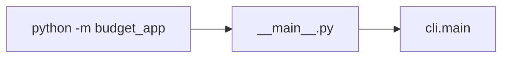
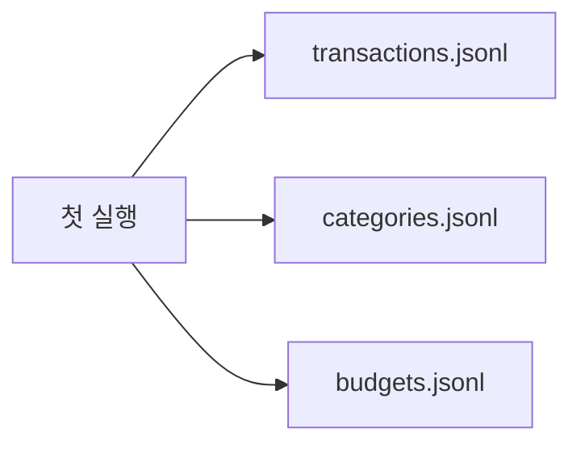

# STEP 01~02 — Python 환경과 JSONL 저장 구조

## STEP 01 — Python 환경과 Reference 구조 확인

### ① 왜 하는가
공식 미션은 Python 3.10 이상과 표준 라이브러리만 허용합니다. 먼저 실행 환경과 코드 구조를 확인해야 이후 오류를 패키지 문제와 프로그램 문제로 구분할 수 있습니다.

### ② 무엇을 하는가
Python 버전, Reference package, 주요 모듈, CLI help를 확인합니다.

### ③ 알아야 할 용어
- **모듈(Module)** — Python 파일 하나를 기능 단위로 나눈 것입니다.
- **패키지(Package)** — 여러 Python 모듈을 묶은 디렉터리입니다.
- **엔트리 포인트(Entry Point)** — 프로그램 실행이 시작되는 위치입니다. 여기서는 `budget_app.__main__`입니다.

### ④ 핵심 개념


### ⑤ 실행
Repository 루트에서:

```bash
python3 --version
export PYTHONPATH="$PWD/training/round-01-clear/reference"
python3 -m budget_app --help
find training/round-01-clear/reference/budget_app -maxdepth 1 -type f -print
```

### ⑥ 명령 해설
- `PYTHONPATH`: Python이 `budget_app` 패키지를 찾을 위치를 알려 줍니다.
- `--help`: 데이터를 바꾸지 않고 CLI 사용법만 확인합니다.
- `find`: Reference 모듈 구성을 확인합니다.

### ⑦ 정상 결과
Python 3.10 이상이 표시되고 add/list/search/summary/update/delete/budget/category/import/export가 help에 나타납니다.

### ⑧ 의미
외부 pip 패키지 없이 B2-1 CLI를 실행할 기본조건이 준비된 것입니다.

### ⑨ 오류와 해결
- `No module named budget_app` → Repository 루트와 `PYTHONPATH`를 확인합니다.
- Python 3.9 이하 → Python 3.10+ 환경으로 변경합니다.

### ⑩ 완료 확인
- [ ] Python 3.10+
- [ ] `python -m budget_app --help`
- [ ] 3개 이상 모듈 구조 확인

---

## STEP 02 — JSONL 3개 파일과 초기 카테고리 이해

### ① 왜 하는가
공식 요구사항은 거래·카테고리·예산을 3개 이상 파일에 영구 저장하고, 초기 실행 시 파일이 없을 때 명확히 처리하는 것입니다.

### ② 무엇을 하는가
별도 실습 데이터 디렉터리에서 첫 실행을 하고 세 파일과 기본 카테고리가 자동 생성되는지 확인합니다.

### ③ 알아야 할 용어
- **JSONL(JSON Lines)** — 한 줄에 JSON 객체 하나를 저장하는 형식입니다.
- **영구 저장(Persistence)** — 프로그램이 종료되어도 데이터가 파일에 남는 것입니다.
- **데이터 디렉터리(Data Directory)** — 실제 저장 파일을 모아 두는 폴더입니다.

### ④ 핵심 개념


Reference는 카테고리 파일이 비어 있으면 `food`, `transport`, `rent`, `salary`, `etc`를 자동 생성합니다.

### ⑤ 실행
```bash
export B2_DATA=/tmp/codyssey-b2-1-data
rm -rf "$B2_DATA"
python3 -m budget_app --data-dir "$B2_DATA" category list
ls -l "$B2_DATA"
```

### ⑥ 명령 해설
- `--data-dir`: 개인 기존 파일과 분리된 실습 저장 위치를 지정합니다.
- `category list`: 초기 카테고리를 읽는 동시에 저장소 초기화를 확인합니다.

### ⑦ 정상 결과
기본 카테고리 목록이 출력되고 `transactions.jsonl`, `categories.jsonl`, `budgets.jsonl` 세 파일이 존재합니다.

### ⑧ 의미
프로그램 종료 후에도 유지되는 파일 기반 저장 구조가 만들어졌습니다.

### ⑨ 오류와 해결
- Permission denied → 쓰기 가능한 실습 폴더를 사용합니다.
- 기존 데이터가 섞임 → 다른 `--data-dir`을 사용합니다.

### ⑩ 완료 확인
- [ ] 저장 파일 3개
- [ ] 기본 카테고리
- [ ] 개인 데이터와 분리

---

[← Module 01](README.md) · [전체 Beginner Guide](../../BEGINNER-GUIDE.md) · [다음 Module →](../02-transactions/README.md)
