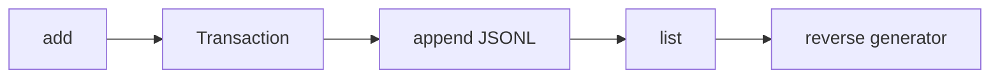
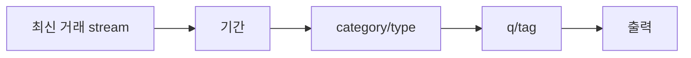

# STEP 03~04 — add/list/search와 Generator Streaming

## STEP 03 — add와 list: 거래 저장과 최신순 스트리밍

### ① 왜 하는가
거래를 저장하고 다시 읽는 것이 가계부의 기본 흐름이며, 공식 요구사항은 list를 전체 메모리 로드가 아닌 generator streaming으로 구현하도록 요구합니다.

### ② 무엇을 하는가
대화형 add로 거래를 저장하고 `list --limit`으로 최신순 출력합니다.

### ③ 알아야 할 용어
- **데이터 클래스(dataclass)** — 데이터 필드와 기본 동작을 간결하게 정의하는 Python 구조입니다.
- **제너레이터(Generator)** — 데이터를 한꺼번에 만들지 않고 필요할 때 하나씩 `yield`하는 방식입니다.
- **스트리밍(Streaming)** — 전체 파일을 메모리에 올리지 않고 순차 처리하는 방식입니다.

### ④ 핵심 개념


Reference의 `iter_jsonl_reverse()`는 파일 뒤쪽을 블록 단위로 읽어 최신 거래부터 하나씩 반환합니다.

### ⑤ 실행
```bash
python3 -m budget_app --data-dir "$B2_DATA" add
python3 -m budget_app --data-dir "$B2_DATA" add
python3 -m budget_app --data-dir "$B2_DATA" list --limit 1
python3 -m budget_app --data-dir "$B2_DATA" list --limit 10
```

add 입력 예:

```text
날짜(YYYY-MM-DD): 2026-08-16
타입(income/expense): expense
카테고리: food
금액(양수): 15000
메모(선택): 점심
태그(쉼표로 구분, 없으면 엔터): meal
```

### ⑥ 명령 해설
- 생성 ID는 `TX-000001` 형태로 증가합니다.
- `list --limit 1`은 필요한 1건을 읽으면 generator가 멈춥니다.

### ⑦ 정상 결과
add마다 `[저장 완료] id=...`가 출력되고 list는 가장 최근 거래부터 표시합니다.

### ⑧ 의미
입력 → 모델 검증 → 파일 저장 → streaming 조회 흐름이 연결된 것입니다.

### ⑨ 오류와 해결
- 잘못된 날짜/금액/type → 원인과 힌트를 확인해 값을 수정합니다.
- 없는 category → `category list` 또는 `category add`를 먼저 사용합니다.

### ⑩ 완료 확인
- [ ] add 성공 + ID
- [ ] list 최신순
- [ ] `--limit`
- [ ] 재실행 후 거래 유지

---

## STEP 04 — search: 조건을 걸어도 Streaming 유지

### ① 왜 하는가
공식 요구사항은 기간·카테고리·타입·메모 키워드·태그 검색을 지원하고 검색도 generator 기반으로 유지하도록 요구합니다.

### ② 무엇을 하는가
각 검색 조건을 실제 저장 데이터에 적용합니다.

### ③ 알아야 할 용어
- **필터(Filter)** — 조건에 맞는 데이터만 통과시키는 처리입니다.
- **키워드 검색(Keyword Search)** — 문자열에 특정 단어가 포함되는지 확인하는 검색입니다.

### ④ 핵심 개념


### ⑤ 실행
```bash
python3 -m budget_app --data-dir "$B2_DATA" search --from 2026-08-01 --to 2026-08-31
python3 -m budget_app --data-dir "$B2_DATA" search --category food
python3 -m budget_app --data-dir "$B2_DATA" search --type expense
python3 -m budget_app --data-dir "$B2_DATA" search --q 점심
python3 -m budget_app --data-dir "$B2_DATA" search --tag meal
```

### ⑥ 명령 해설
`--from`/`--to`는 날짜 범위, `--q`는 memo 문자열, `--tag`는 tags 목록을 검사합니다.

### ⑦ 정상 결과
조건을 만족하는 거래만 최신순으로 출력되며 결과가 없으면 안내가 표시됩니다.

### ⑧ 의미
저장 구조를 유지하면서 여러 조건을 조합해 필요한 거래를 streaming으로 찾습니다.

### ⑨ 오류와 해결
- `--from`이 `--to`보다 늦음 → 날짜 범위를 바로잡습니다.
- 등록되지 않은 category → `category list`로 실제 이름을 확인합니다.

### ⑩ 완료 확인
- [ ] 기간
- [ ] category
- [ ] type
- [ ] q
- [ ] tag
- [ ] 최신순
- [ ] generator streaming 설명 가능

---

[← Module 02](README.md) · [다음 학습 단위 →](02-update-delete.md)
