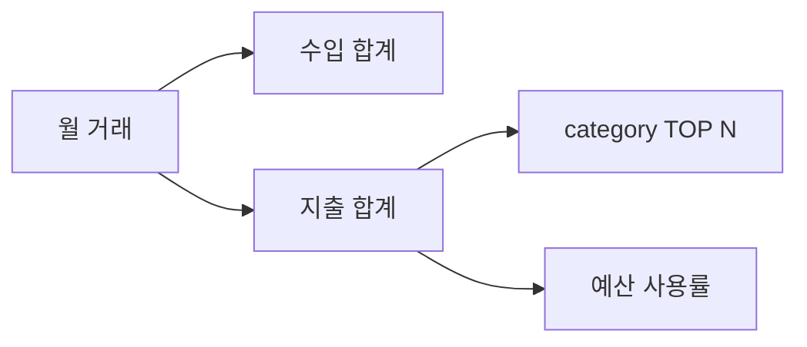

# STEP 06 — summary와 budget

## ① 왜 하는가
단순 CRUD를 넘어 한 달의 수입·지출을 집계하고 예산과 비교해야 실제 가계부 기능이 됩니다.

## ② 무엇을 하는가
월 예산을 저장하고 월별 총수입/총지출/잔액/카테고리 TOP N/예산 사용률/초과 여부를 출력합니다.

## ③ 알아야 할 용어
- **집계(Aggregation)** — 여러 거래를 합계나 순위로 요약하는 계산입니다.
- **예산 사용률(Budget Usage)** — 월 지출 ÷ 월 예산 × 100입니다.

## ④ 핵심 개념


## ⑤ 실행
```bash
python3 -m budget_app --data-dir "$B2_DATA" budget set --month 2026-08 --amount 500000
python3 -m budget_app --data-dir "$B2_DATA" summary --month 2026-08 --top 3
python3 -m budget_app --data-dir "$B2_DATA" summary --month 2099-01 --top 3
```

## ⑥ 명령 해설
예산은 `budgets.jsonl`에 영구 저장되고 summary가 같은 월의 예산을 읽어 사용률을 계산합니다.

## ⑦ 정상 결과
데이터가 있는 달은 수입/지출/잔액/TOP N과 예산 정보가 나오고, 없는 달은 `데이터 없음`이 명확히 표시됩니다.

## ⑧ 의미
거래 파일과 예산 파일의 데이터를 서비스 계층에서 함께 사용해 월 단위 비즈니스 결과를 만든 것입니다.

## ⑨ 오류와 해결
- `YYYY-MM` 오류 → 월 형식을 수정합니다.
- 예산 0/음수 → 양의 정수로 입력합니다.

## ⑩ 완료 확인
- [ ] budget persistence
- [ ] total income/expense/balance
- [ ] TOP N
- [ ] usage %
- [ ] over-budget warning
- [ ] no-data month

---

[← Module 03](README.md) · [다음 학습 단위 →](02-categories.md)
