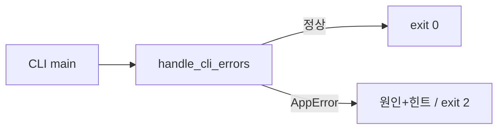

# STEP 09 — Decorator, Type Hints, 오류 종료 코드

## ① 왜 하는가
평가는 기능뿐 아니라 공통 관심사 분리, 타입 계약, 사용자 친화적 오류 처리를 설명할 수 있는지 확인합니다.

## ② 무엇을 하는가
`handle_cli_errors`, 함수 type hints, 대표 오류 출력을 코드와 실제 실행으로 연결합니다.

## ③ 알아야 할 용어
- **데코레이터(Decorator)** — 함수 실행 전후의 공통 동작을 별도로 감싸는 Python 기능입니다.
- **타입 힌트(Type Hint)** — 함수 입력/출력의 예상 타입을 코드에 명시하는 표기입니다.
- **종료 코드(Exit Code)** — shell에 성공/실패를 숫자로 전달하는 값입니다.

## ④ 핵심 개념


## ⑤ 실행
```bash
python3 -m budget_app --data-dir "$B2_DATA" delete --id TX-999999
echo "exit=$?"

grep -Rni 'def handle_cli_errors\|Generator\[Transaction' \
  training/round-01-clear/reference/budget_app
```

## ⑥ 명령 해설
- `handle_cli_errors`는 각 기능마다 반복될 예외 출력 코드를 한 곳에 모읍니다.
- `Generator[Transaction, ...]`은 list/search가 list 전체 반환이 아니라 streaming 계약임을 보여 줍니다.
- `__main__.py`는 `SystemExit(main())`으로 반환 코드를 운영체제에 전달합니다.

## ⑦ 정상 결과
오류에 stacktrace가 없고 `[오류]`, `[힌트]`, `exit=2`가 보입니다.

## ⑧ 의미
사람과 shell 모두 실패를 명확히 인식하고, 공통 오류 정책을 한 곳에서 관리합니다.

## ⑨ 오류와 해결
argparse가 잘못된 옵션을 받으면 자체 사용법과 함께 exit 2를 반환합니다. 이는 정상적인 CLI 오류 처리입니다.

## ⑩ 완료 확인
- [ ] decorator 실제 적용
- [ ] type hints 실제 사례 설명
- [ ] stacktrace 없음
- [ ] 오류 exit != 0

---

[← Module 05](README.md) · [다음 학습 단위 →](02-runtime-evidence-clear.md)
